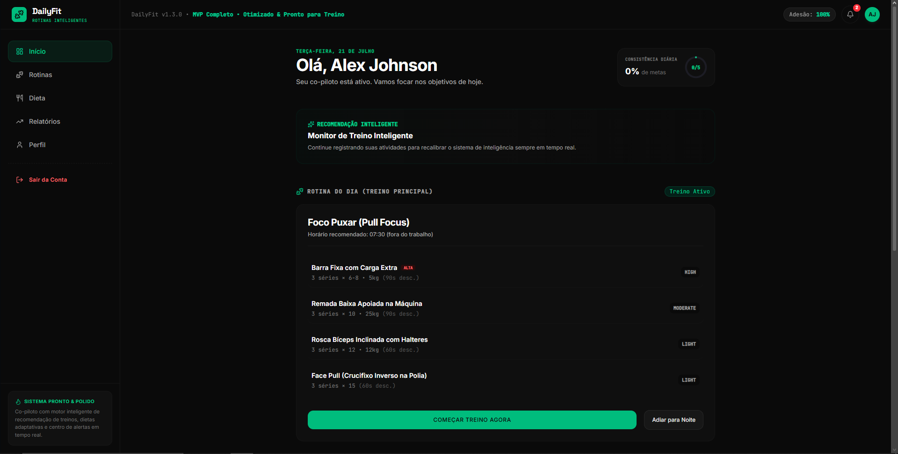
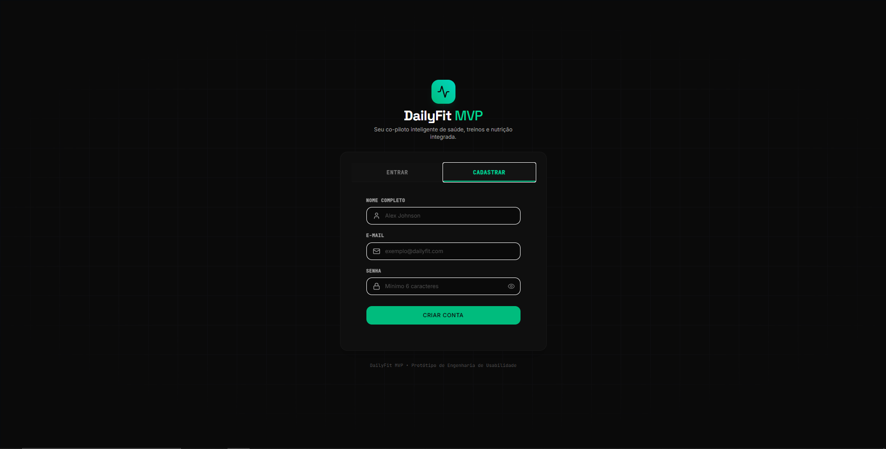
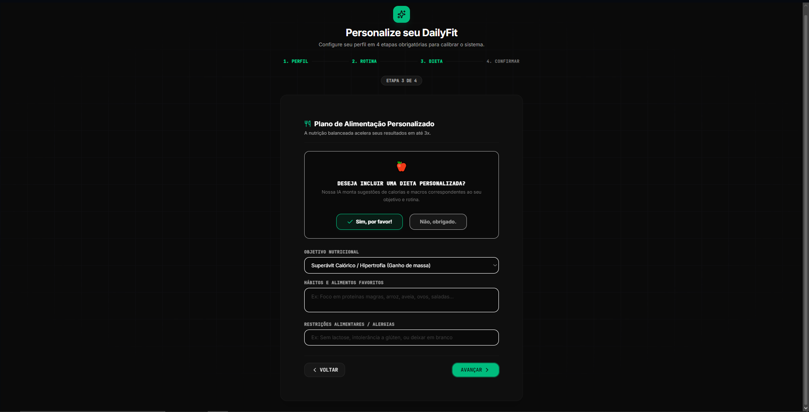

# 🏋️ DailyFit

Sistema de Gestão para Academias desenvolvido como projeto acadêmico da disciplina Introdução à Análise de Sistemas da FAETERJ.

## 📖 Sobre o Projeto

O **DailyFit** é um sistema de gestão para academias desenvolvido como projeto acadêmico da disciplina **Introdução à Análise de Sistemas**, do curso de Análise e Desenvolvimento de Sistemas da FAETERJ-Rio.

O projeto teve como objetivo aplicar conceitos de Engenharia de Software, incluindo levantamento de requisitos, modelagem UML, documentação técnica e desenvolvimento de uma solução voltada para o gerenciamento de rotinas saudáveis.

## 🤖 Inteligência Artificial

O projeto utiliza IA Generativa para auxiliar os usuários na elaboração de rotinas saudáveis, fornecendo sugestões de treinos, dietas e suplementação com base nas informações cadastradas.

## 🚀 Funcionalidades

- Cadastro de usuários
- Gerenciamento de alunos
- Cadastro de exercícios
- Criação de treinos personalizados
- Planejamento de dietas
- Controle de suplementação
- Sugestões utilizando Inteligência Artificial Generativa

## 🛠 Tecnologias Utilizadas

- Google AI Studio
- Inteligência Artificial Generativa
- UML
- Engenharia de Software

## 📚 Engenharia de Software

Durante o desenvolvimento foram realizadas as seguintes etapas:

- Levantamento de requisitos
- Documento de requisitos
- Modelagem UML
- Diagrama de Casos de Uso
- Diagrama de Classes
- Documentação técnica

## 🎯 Competências Desenvolvidas

- Levantamento de requisitos
- Engenharia de Software
- Modelagem UML
- Documentação de Software
- Trabalho em equipe
- Análise de Sistemas

## 📄 Documentação

A documentação completa do projeto está disponível na pasta **docs/**.

Ela inclui:

- Documento de Requisitos
- Diagrama de Casos de Uso
- Diagrama de Classes
- Protótipos de Interface

## 📷 Interface

### Tela Inicial

### Cadastro de Usuário

### Sugestões com IA

## 👨‍💻 Autores

- Marcus Vinicius Simões Bordignon
- Tiago Luiz da Silva Perri

---

Projeto desenvolvido durante o 1º período do curso de Análise e Desenvolvimento de Sistemas da FAETERJ-Rio.
